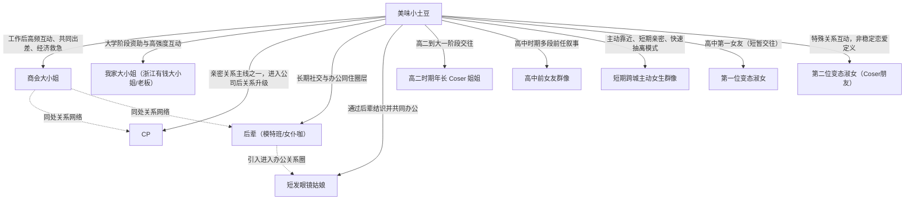
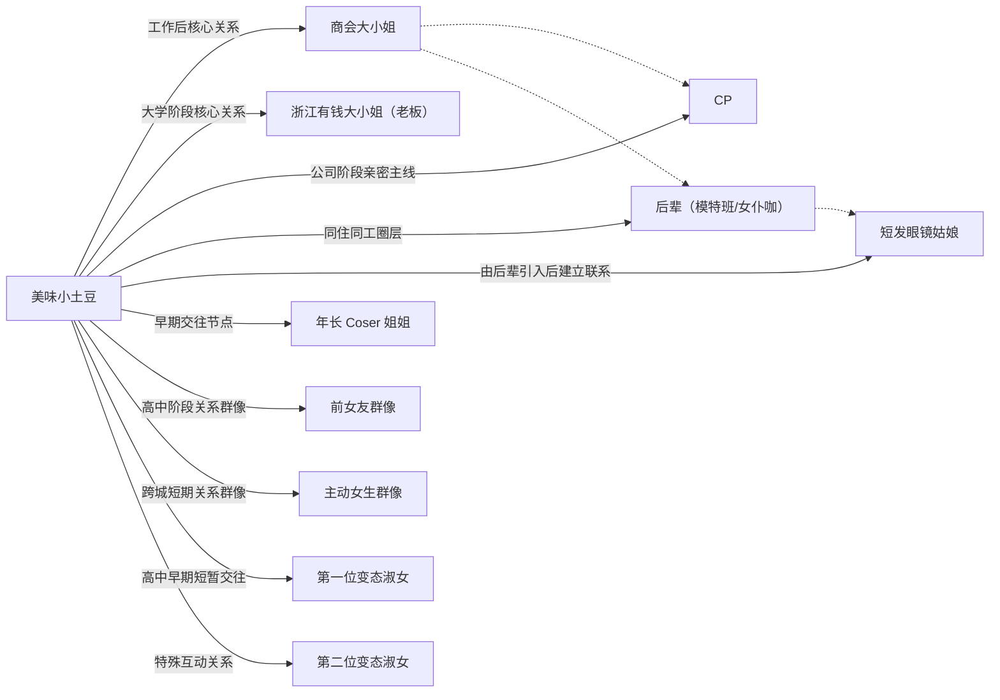

# 美味小土豆：人物关系图谱（基于文本自述）

> 说明：本图谱仅基于仓库内已抓取文本（`extracted_mds/`、`events_raw.csv`、`events.csv`）进行关系整理。
> 由于原始内容存在叙事加工与文学化表达，以下关系按“文本可支持程度”分为高/中/低可信度，不等同于现实世界事实认定。

## 1) 人物关系图（Mermaid）

## 1.1) 关系图精修版（兼容性更高）

## 2) 核心关系分层（按可信度）

### A层：高可信（多文本反复出现，且事件链相对完整）
1. **商会大小姐（工作后关键关系）**
   - 线索：共同出差、绿皮车同行、每周固定见面、加入其公司担任司机、在其债务困难时提供资金帮助。
   - 主要证据：
     - `extracted_mds/女朋友明确说以后只能同甘，不能共苦怎么办__美味小土豆_2026-03-24_2019862779276862957.md`
     - `extracted_mds/办公室中的同事全部为女性，是种怎样的体验？_美味小土豆_2026-03-04_2012627725832177108.md`
     - `events_raw.csv` 中“绿皮车同行/司机入职/获救经历”等条目

2. **“我家大小姐/浙江有钱大小姐（老板）”（大学阶段关键关系）**
   - 线索：19岁与31岁老板建立长期高强度互动，经济与生活资助明显，后因对方结婚结束。
   - 主要证据：
     - `extracted_mds/为什么姐弟恋里，大龄姐姐总是想逼弟弟上进？_美味小土豆_2025-08-17_1940427622078198830.md`

### B层：中可信（文本出现频繁，但边界定义模糊）
3. **CP（长期亲密对象之一）**
   - 线索：在公司关系网络中出现、与后辈及商会大小姐构成同一互动网络。
   - 证据：
     - `extracted_mds/女朋友明确说以后只能同甘，不能共苦怎么办__美味小土豆_2026-03-24_2019862779276862957.md`
     - `extracted_mds/办公室中的同事全部为女性，是种怎样的体验？_...2012627725832177108.md`

4. **后辈（模特班/女仆咖）与短发眼镜姑娘**
   - 线索：长期办公同住与社交共同体成员，对其关系网络扩展有直接作用。
   - 证据：
     - `extracted_mds/办公室中的同事全部为女性，是种怎样的体验？_...2012627725832177108.md`
     - `events_raw.csv` 相关条目

### C层：中低可信（多为“群像/回忆叙事”，可证性弱）
5. **高二时期年长Coser姐姐**
   - 线索：高二与大一阶段交往叙事，属于早期关系节点。
   - 证据：
     - `extracted_mds/为什么现在恋爱中的女生总在“教男友谈恋爱”？男生是真不懂，还是懒得懂？_...2013895036589344567.md`

6. **高中前女友群像、短期跨城主动女生群像、"变态淑女"叙事对象**
   - 线索：用于解释其“关系密度高”的叙事来源。
   - 证据：
     - `extracted_mds/两个变态谈恋爱是什么感觉？_美味小土豆_2024-08-31_3612090832.md`
     - `extracted_mds/女生主动起来有多主动？_美味小土豆_2026-03-02_2011859994748920832.md`
     - `events_raw.csv` 相关条目

## 3) “为什么看起来女朋友很多”的结构性解释

1. **筛选机制：只回应主动示好对象**  
   降低追求成本，提高关系发生频次。

2. **关系边界弱化：恋爱/搭子/同事/资助关系重叠**  
   在文本层面容易都被读者归入“女朋友”。

3. **叙事放大：高戏剧化写作让关系密度感上升**  
   平台叙事把“关系网络”呈现成“连续修罗场”。

4. **圈层接触频率高：模特/cos/女仆咖/跨城见面网络**  
   本身就提供更多异性交往机会。

## 4) 女友/亲密对象时间线（文本锚点版）

| 时段锚点 | 主要对象 | 关系描述（文本口径） | 可信度 |
|---|---|---|---|
| 高中早期 | 第一位“变态淑女” | 自述高中第一任女友，短期交往后分手 | 中 |
| 高二阶段 | 年长Coser姐姐（大一） | 四角关系曝光后开始交往 | 中 |
| 高中-大学过渡期 | 多位前女友/主动女生群像 | 高密度短期关系与快速抽离 | 中低 |
| 约19岁大学期 | 浙江有钱大小姐（老板） | 资助+高频陪伴关系，后因其结婚结束 | 中高 |
| 工作后创业缺钱期 | 商会大小姐 | 出差同行、每周固定互动、后续财务救急 | 高 |
| 同期（小公司阶段） | CP、后辈、商会大小姐等 | 多人关系网络并行，边界混合 | 中 |

## 5) 使用建议

- 若后续要做更严格版关系图，建议新增字段：`关系类型(恋爱/暧昧/同事/叙事角色)`、`时间起止`、`证据条数`、`冲突证据`。
- 对外展示时建议明确标注：**“文本社会学整理，不做现实身份与事实判定”**。
